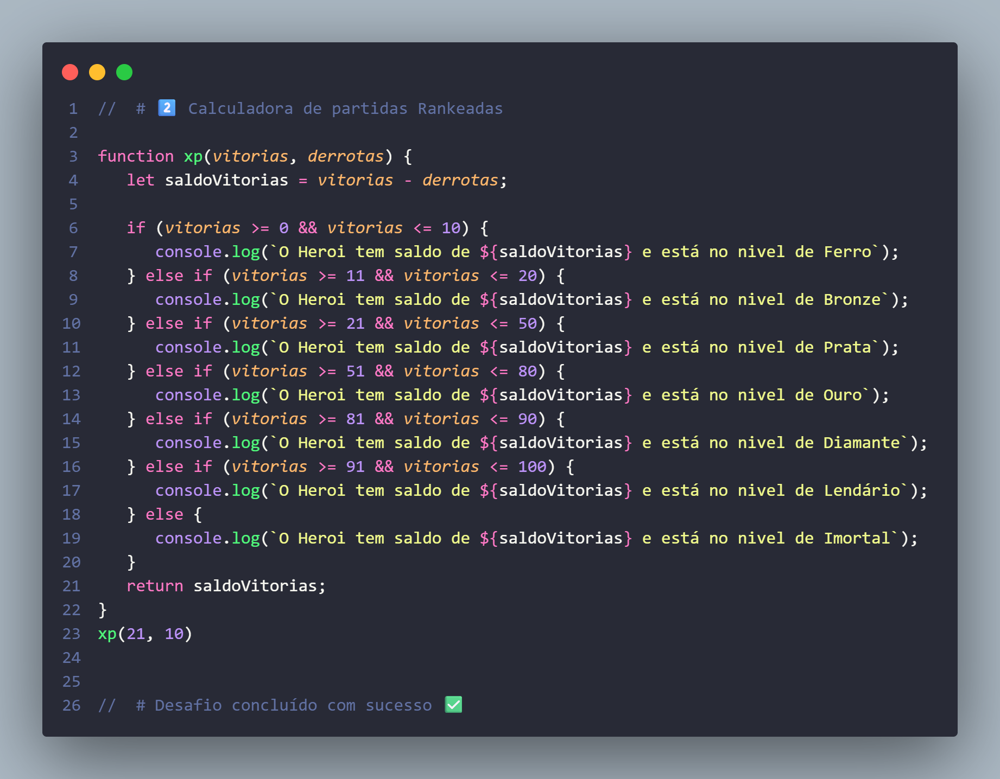

[README .md](https://github.com/user-attachments/files/24702257/README.md)
# 🧮 Calculadora de Partidas Rankeadas

Projeto desenvolvido como parte de um desafio da plataforma **DIO** para
praticar lógica de programação com JavaScript.

## 📌 Descrição

A aplicação calcula o saldo de vitórias de um jogador com base na
quantidade de vitórias e derrotas informadas e define o nível do herói
conforme as regras do desafio.

## 🛠️ Tecnologias Utilizadas

-   JavaScript

## 📚 Conceitos Aplicados

-   Variáveis
-   Operadores aritméticos e relacionais
-   Funções
-   Estruturas de decisão (`if / else`)

## 🧠 Regras de Classificação

-   Ferro: até 10 vitórias\
-   Bronze: 11 a 20 vitórias\
-   Prata: 21 a 50 vitórias\
-   Ouro: 51 a 80 vitórias\
-   Diamante: 81 a 90 vitórias\
-   Lendário: 91 a 100 vitórias\
-   Imortal: acima de 100 vitórias


## ▶️ Exemplo de Uso

``` js
xp(21, 10);
```

### 📤 Saída esperada

    O Herói tem de saldo de 11 está no nível de Prata


## 🖨️ Print da Saída no Console




## ✅ Status

Desafio concluído com sucesso 🎉
